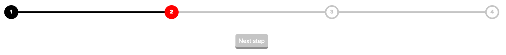

# step-progress-bar



A step progress bar to vizualize the progress of a  online From.


## Installation

Use [yarn](https://yarnpkg.com) to install step-progress-bar.

```bash
yarn install
```

## Usage

```js
//input data
let input = {
    steps: [
        {

            text: "1",
            status: "selected", // ["link", "selected", "silent"]
        },
        {

            text: "2",
            status:  "silent", // ["link", "selected", "silent"]
        },
        {
            text: "3",
            status: "silent", // ["link", "selected", "silent"]
        },
        {
            text: "4",
            status: "silent", // ["link", "selected", "silent"]
        }
    ]
};
//set progress
setCurrentStep(input);
```

## Author
* Felix Knorre <felix-knorre@hotmail.de>

## License
[MIT](https://choosealicense.com/licenses/mit/)
