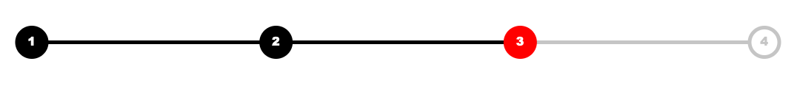

# step-progress-bar



A step progress bar to vizualize the progress of a online from.


## Installation

Use [npm](https://www.npmjs.com) to install step-progress-bar.

```bash
npm install
```

## Usage
Name the id of the container div "step-progress-bar".
The bar adapts to the container div.

```js
// -- demo input --
// demo input
let input = {
    steps: [
        {

            text: "1",
            status: "visited", // ["visited", "selected", "silent"],
            url: "www.google.de"
        },
        {

            text: "2",
            status:  "visited", // ["visited", "selected", "silent"],
            url: "www.google.de"
        },
        {
            text: "3",
            status: "selected", // ["visited", "selected", "silent"]
            url: "www.google.de"
        },
        {
            text: "4",
            status: "silent", // ["visited", "selected", "silent"]
            url: ""
        }
    ]
}

dimensionsInput = {
    width: 300,
    height: 100,
    margin: {
        top: 50,
        right: 25,
        bottom: 50,
        left: 25
    },
    bar: {
        height: 5,
        rx: 5
    },
    circle: {
        r: 20,
        strokeWidth: 5
    }
}

colorInput = {
    link: "#000000", // link
    selected: "#ff0000", // selected
    silent: "#cccccc", // silent
    white: "#ffffff",

}

styleInput = {
    fontFamily: "Arial Black",
    fontSize: 15
}

// -- draw bar for the first time --
drawStepProgressBar(input, dimensionsInput, colorInput, styleInput);
```

## Author
* Felix Knorre <felix-knorre@hotmail.de>

## License
[MIT](https://choosealicense.com/licenses/mit/)
